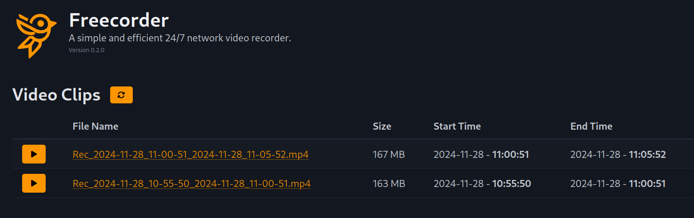

# Freecorder

Freecorder is minimalist NVR (Network Video Recorder). It was designed to record IP camera footage 24/7 in a rolling manner. It is simple to set up, runs on almost every platform (Docker or bare metal) and uses very little resources.



The following features make this project unique:
- Ultra low resource usage: this project was designed to run with minimal CPU and memory footprint. No GPU/NPU is required.
- Flexible deployment options: you can run this project bare metal, e.g. on a Rasberry Pi, or deploy it via Docker, e.g. on your NAS.
- Total simplicity: the user interface is clean, modern, minimalistic and very easy to use.

## Features

- 24/7 continuous video recording from an RTSP stream (IP camera).
- Audio and video support.
- Web interface for browsing all recorded clips.
- Direct playback of clips via the web interface.
- Direct downloading of clips via the web interface.

## What this project does *NOT* offer

In order to achieve minimal hardware resource usage, several features implemented by other NVR systems are not available in this project:
- Live video view
- Motion detection
- Object detection

If you require these features, take a look at other projects like Frigate, Shinobi or ZoneMinder.

# Configuration

Create a *config.yml* based on the [template](templates/config.yml). The only thing you *have* to change is the stream URL for your IP camera.

# Deployment

## Via Docker

Freecorder is easy to set up with Docker Compose.
Create a *data* folder (for configuration and logging) and a *recordings* folder (e.g. on a mounted high endurance Micro SD card).
Place your *config.yml* in the data folder.

```
services:
  freecorder:
    container_name: freecorder
    image: borisbrock/freecorder:latest
    restart: always
    ports:
      - "8020:5000"
    volumes:
      - /volume1/docker/freecorder/data:/data
      - /volume1/docker/freecorder/recordings:/recordings
```

(see the [Docker Compose template](templates/docker-compose.yml))

# Used Assets and Libraries

The following assets and libraries are used by this project:

- [PicoCSS](https://picocss.com/)
- [ffmpeg](https://ffmpeg.org/)
